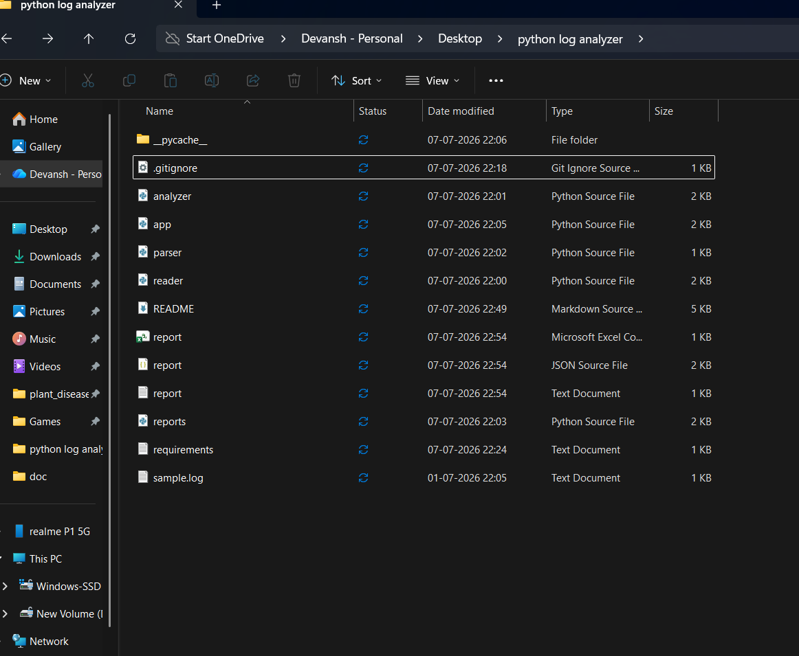
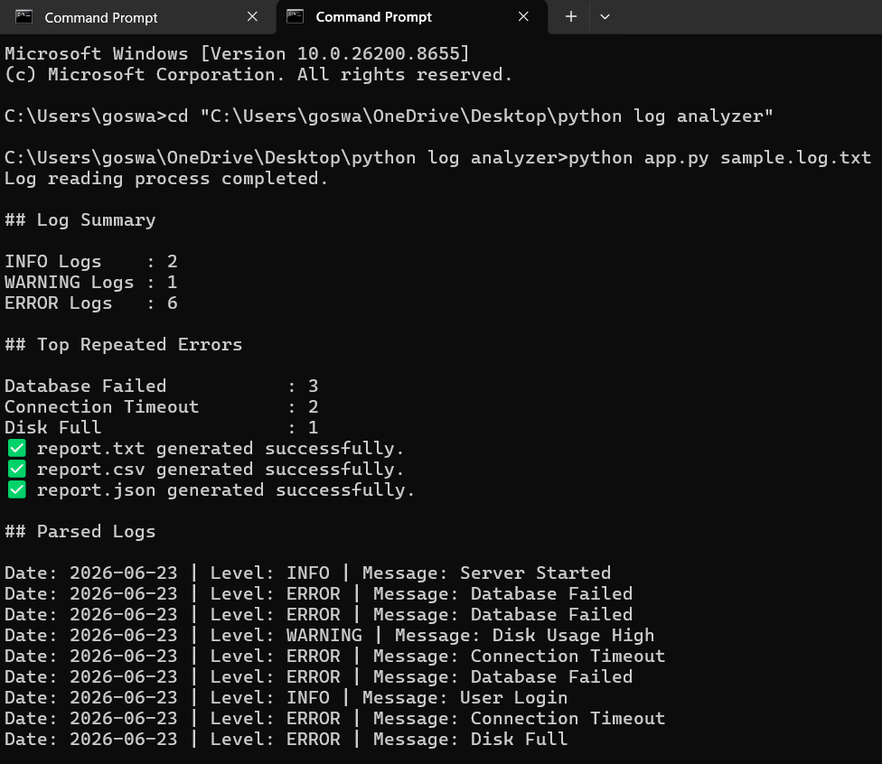

# Python Log Analyzer CLI Tool


A modular **Python Command-Line Interface (CLI)** application that analyzes server log files, detects repeated errors, parses log entries, and generates TXT, CSV, and JSON reports.

This project was developed as part of my **Cloud & DevOps Placement Preparation** to demonstrate Python automation, log analysis, modular programming, and Git/GitHub workflow.

---

# Features

- Read log files
- Count INFO, WARNING and ERROR logs
- Find top repeated ERROR messages
- Parse log files using Regular Expressions (Regex)
- Generate TXT report
- Generate CSV report
- Generate JSON report
- Analyze multiple log files
- Command Line Interface using argparse
- Modular Python project architecture

---

# Technologies Used

- Python 3
- File Handling
- Exception Handling
- Dictionaries
- Lists
- collections.Counter
- Regular Expressions (re)
- CSV Module
- JSON Module
- argparse
- os Module
- Git
- GitHub

---

# Project Structure

```text
python-log-analyzer/
│
├── app.py               # Main entry point
├── reader.py            # Reads log files
├── analyzer.py          # Log analysis
├── parser.py            # Regex log parser
├── reports.py           # TXT, CSV & JSON reports
├── sample.log.txt       # Sample log file
├── README.md
├── requirements.txt
└── .gitignore
```

---

# How It Works

```
           sample.log.txt
                  │
                  ▼
            reader.py
                  │
                  ▼
           analyzer.py
          /      |       \
         ▼       ▼        ▼
   parser.py reports.py Statistics
          \      |      /
           \     |     /
                app.py
                  │
                  ▼
        CLI Output + Reports
```

---

# Sample Log File

```text
2026-06-23 INFO Server Started
2026-06-23 ERROR Database Failed
2026-06-23 WARNING Disk Usage High
2026-06-23 ERROR Connection Timeout
```

---

# Installation

Clone the repository

```bash
git clone https://github.com/Dev9712/python-log-analyzer.git
```

Move into the project directory

```bash
cd python-log-analyzer
```

---

# Usage

Analyze a single log file

```bash
python app.py sample.log.txt
```

Analyze multiple log files inside a folder

```bash
python app.py logs
```

---

# Sample Output

```text
Log Summary

INFO Logs    : 2
WARNING Logs : 1
ERROR Logs   : 6

Top Repeated Errors

Database Failed           : 3
Connection Timeout        : 2
Disk Full                 : 1

report.txt generated successfully.
report.csv generated successfully.
report.json generated successfully.
```

---

# Reports Generated

The application automatically generates

- report.txt
- report.csv
- report.json

---

# Cloud & DevOps Relevance

Log analysis is an important responsibility of Cloud Engineers, DevOps Engineers, Site Reliability Engineers (SREs), and Production Support Engineers.

This project demonstrates practical skills in:

- Log Analysis
- Python Automation
- CLI Tool Development
- Regular Expressions
- File Processing
- JSON & CSV Reporting
- Modular Programming
- Git Version Control
- GitHub Repository Management

---

# Skills Demonstrated

- Python Programming
- File Handling
- Exception Handling
- Regular Expressions
- JSON
- CSV
- argparse
- Dictionaries
- Counter
- Modular Programming
- Git
- GitHub

---

# Future Improvements

- Filter logs by log level
- Date-wise log filtering
- Docker support
- Flask Web Dashboard
- Email reports
- Database integration
- AWS CloudWatch Log support

---

# Author

**Devansh Goswami**

Aspiring Cloud Support / DevOps Engineer

GitHub:
https://github.com/Dev9712

---

## License

This project is created for learning and placement preparation purposes.


---

# 📸 Screenshots

## 📁 Project Structure




## 💻 CLI Output
